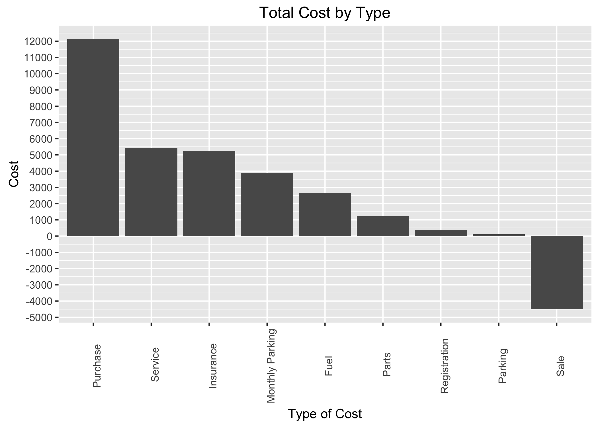
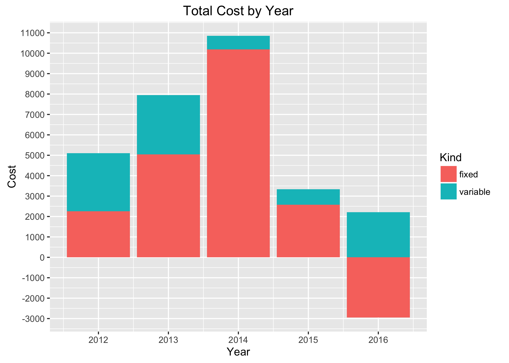
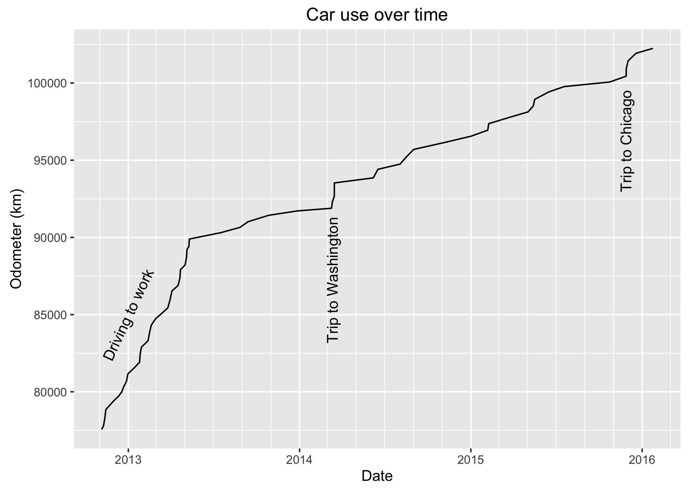

# Mazda3 Analysis
Daley Mikalson  
August 7, 2016  


Have you ever thought about how much you are spending on your car?

## The data
For some reason, I kept all the records related to my car for all the years that I owned it. Now that I have sold the car, I am going to clear all the paper out, but not before seeing what it tells me about what the car cost me.

I used a fuel tracker for iOS called [MileageKeeper](http://mileagekeeper.com "Mileage Keeper") and it worked well enough that I didn't ever look for a new one. It has the ability to export and import .csv files, which was quite helpful when Apple had to give me a new phone with a functioning camera.

I have all the service records at a couple different garages in Ottawa and Toronto. This includes oil changes, swapping winter/summer tires and repairs. The few times that I had to pay for parking are also in my saved data. The only thing that is missing is all the random times that I stopped for car washes.


```r
fuel <- read.csv("data/Mazda3.csv")

fuel$Distance <- c(-diff(fuel$Odometer),NA)
fuel$L.100km <- fuel$Fuel.Amount / fuel$Distance * 100
fuel$Date <- ymd(fuel$Date)
fuel$Span <- time_length(c(-int_diff(fuel$Date), NA), unit = "day")
summary(fuel)
```

```
##       Date               Odometer       Fuel.Amount      Total.Cost   
##  Min.   :2012-11-03   Min.   : 77022   Min.   :15.63   Min.   :18.67  
##  1st Qu.:2013-02-05   1st Qu.: 83101   1st Qu.:32.38   1st Qu.:35.15  
##  Median :2013-05-11   Median : 89894   Median :36.61   Median :41.60  
##  Mean   :2013-12-18   Mean   : 89602   Mean   :36.02   Mean   :42.15  
##  3rd Qu.:2014-10-05   3rd Qu.: 95934   3rd Qu.:41.36   3rd Qu.:49.81  
##  Max.   :2016-01-24   Max.   :102244   Max.   :45.97   Max.   :59.63  
##                                                                       
##            Note    Partial        Skipped           Distance    
##              :61   Mode:logical   Mode:logical   Min.   :173.0  
##  After clutch: 1   NA's:63        NA's:63        1st Qu.:346.8  
##  H paid      : 1                                 Median :408.5  
##                                                  Mean   :406.8  
##                                                  3rd Qu.:491.0  
##                                                  Max.   :561.0  
##                                                  NA's   :1      
##     L.100km            Span      
##  Min.   : 7.099   Min.   : 0.00  
##  1st Qu.: 8.009   1st Qu.: 3.00  
##  Median : 8.755   Median : 9.50  
##  Mean   : 9.087   Mean   :18.98  
##  3rd Qu.:10.051   3rd Qu.:32.25  
##  Max.   :12.737   Max.   :97.00  
##  NA's   :1        NA's   :1
```

```r
service <- read.csv("data/Service.csv")
summary(service)
```

```
##          Date          Type                          Item  
##  2013-07-22: 2    Parts  : 4    Tire Change            :6  
##  2014-05-24: 2    Service:16    Oil Change             :5  
##  2015-05-05: 2                  Headlight              :2  
##  2015-11-13: 2                  Drive Clean            :1  
##  2012-12-10: 1                  O2 Sensor              :1  
##  2012-12-13: 1                  Replace Air Conditioner:1  
##  (Other)   :10                 (Other)                 :4  
##       Cost                         Provider     Odometer
##  Min.   :  16.70    Cam's              :12    100148:2  
##  1st Qu.:  39.89    Canadian Tire      : 2    90350 :2  
##  Median :  55.37    Costco             : 2    93720 :2  
##  Mean   : 331.23    Ottawa Transmission: 1    98188 :2  
##  3rd Qu.: 128.24    OttawaTiresDirect  : 2    NA    :2  
##  Max.   :2179.03    Walmart            : 1    102391:1  
##                                              (Other):9
```

```r
fixed <- read.csv("data/Fixed.csv")
summary(fixed)
```

```
##          Date            Description      Cost        
##  2013-05-01: 3   Insurance     :45   Min.   :-4500.0  
##  2013-06-01: 3   Parking Space :39   1st Qu.:  100.0  
##  2013-07-01: 3   Loan Payment  :15   Median :  110.7  
##  2013-08-01: 3   Registration  : 2   Mean   :  163.0  
##  2013-09-01: 3   Downpayment   : 1   3rd Qu.:  116.1  
##  2013-10-01: 3   Loan Repayment: 1   Max.   : 7002.8  
##  (Other)   :87   (Other)       : 2                    
##               Type   
##  Insurance      :45  
##  Monthly Parking:39  
##  Purchase       :17  
##  Registration   : 3  
##  Sale           : 1  
##                      
## 
```

```r
parking <- read.csv("data/Parking.csv")
summary(parking)
```

```
##          Date      Start.Time        End.Date     End.Time 
##  2012-11-05: 2    10:09 : 1    2012-11-05: 2    9:54  : 4  
##  2012-11-03: 1    10:45 : 1    2012-11-04: 1    23:00 : 3  
##  2012-11-09: 1    12:07 : 1    2012-11-10: 1    0:22  : 1  
##  2012-11-10: 1    14:05 : 1    2012-11-11: 1    10:00 : 1  
##  2012-11-11: 1    17:05 : 1    2012-11-12: 1    10:06 : 1  
##  2012-12-18: 1    17:52 : 1    2012-12-19: 1    10:28 : 1  
##  (Other)   :21   (Other):22   (Other)    :21   (Other):17  
##       Cost                    City   
##  Min.   : 0.500    Ottawa       : 4  
##  1st Qu.: 2.250    Richmond Hill: 3  
##  Median : 3.000    Toronto      :21  
##  Mean   : 4.021                      
##  3rd Qu.: 4.562                      
##  Max.   :15.000                      
## 
```
### Breakdown of types of costs
Let's look at the total for each cost area.


```
## # A tibble: 9 x 2
##              Type     Cost
## *          <fctr>    <dbl>
## 1       Insurance  5239.79
## 2 Monthly Parking  3867.00
## 3        Purchase 12135.36
## 4    Registration   369.15
## 5            Sale -4500.00
## 6           Parts  1207.51
## 7         Service  5417.17
## 8            Fuel  2655.65
## 9         Parking   112.58
```





Over the 3.75 years I owned the car I spent $26504.21, which translates into an average of $7070.37/year. The annual average does not really tell you the breakdown of when I spent all that money because it was not equal over the whole time.

### Annual cost breakdown
How did it look when looked at by year. It is useful to also break it out by Fixed vs. Variable. The really big bar in 2014 is mostly explained by me paying off the balance of the car so that I would stop paying 4.99% interest each year.



### Take out 'sunk' costs
Of course, most people do not think of their costs like that, so let's take a different view. The purchase price of the car is a sunk cost that does not exist in the mind of most people. The only purchase cost included below is the interest on the loan. Negative fixed costs in 2016 are repairs to get the safety certificate minus the sale price.


### Bits of random info
- Purchase Price: $10000 + tax
- Sale Price: $4500
- Duration of ownership: 3.75 years
- Total spent on car: $26504.21
- Distance travelled in car: 25388 km
- Price per km driven: $1.04/km

## What about fuel?
The car was ok on fuel and had a mean fuel economy of 9.09 L/100km with a range from 7.1 to 12.74. The plot below really shows the variation of highway driving and city driving. Highway driving is clearly shown where the time between fills is 0 - 2 days in the first plot.


### When and how much?
I recorded my odometer reading and the date each time I filled up with fuel so it is easy to see how my use of the car changed after I moved from Ottawa in mid-2013 and did not need to drive to work every day. Road trips to Washington, D.C. and Chicago are also shown with their steep jumps.


